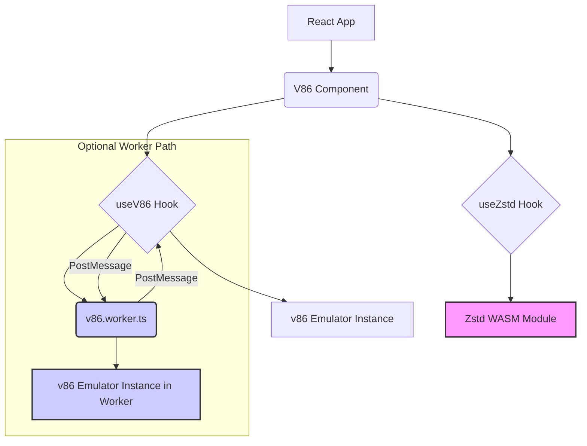

# System Patterns

*This file documents the overall architecture, key technical decisions, and design patterns used in the project.*

## System Architecture Overview

*This project is a React component library designed to wrap the `v86` JavaScript x86 emulator. The core architecture involves:*
*   **React Components:** Provide the user interface and integration point (`V86.tsx`, `V86WithWorker.tsx`).
*   **Custom Hooks:** Encapsulate logic for interacting with the emulator (`useV86.ts`) and handling related tasks like decompression (`useZstd.ts`).
*   **Web Worker:** Offloads the potentially intensive v86 emulation process from the main UI thread (`v86.worker.ts`).
*   **v86 Library:** The underlying emulator logic (potentially included locally in `src/lib` or `src/v86`).
*   **WASM Module:** Used for Zstandard decompression (`@bokuweb/zstd-wasm`).

## Key Technical Decisions

*   **React:** Chosen as the target framework for the wrapper component, leveraging its component model and ecosystem.
*   **TypeScript:** Provides static typing for better code maintainability and developer experience.
*   **Web Workers:** Used to run the v86 emulator off the main thread, preventing UI freezes during intensive emulation tasks.
*   **Custom Hooks:** Abstract complex logic related to emulator setup, state management, and worker communication, promoting reusability and cleaner components.
*   **Local v86 Dependency:** Including `v86` locally (`file:src/v86`) allows for potentially customized builds or avoids reliance on external package managers for this core piece. Requires careful management.
*   **Zstandard WASM:** Using a WASM module for decompression allows efficient handling of potentially large compressed disk images directly in the browser.

## Design Patterns in Use

*   **React Component Patterns:** Standard patterns like props for configuration, state management (likely `useState`, `useReducer`), and lifecycle management (`useEffect`).
*   **Custom Hook Pattern:** Encapsulating reusable stateful logic related to v86 and Zstandard.
*   **Web Worker Communication:** Using `postMessage` and event listeners (`onmessage`) for asynchronous communication between the main thread (React component/hook) and the v86 worker.
*   **(Potential) Facade:** The `V86` component acts as a simplified interface (facade) over the more complex underlying v86 library API.

## Component Relationships & Interactions

*   The consuming React application uses the exported `V86` component.
*   The `V86` component utilizes the `useV86` hook to manage the emulator instance and state.
*   `useV86` either interacts directly with the `v86` library or communicates with `v86.worker.ts` via `postMessage`.
*   `v86.worker.ts` runs the `v86` emulator instance and sends updates back to `useV86` via `postMessage`.
*   The `useZstd` hook is likely used by `useV86` or the component to decompress assets (e.g., disk images) before passing them to the emulator. It interacts with the Zstandard WASM module.
*   Storybook stories (`*.stories.tsx`) import and render the components for development and testing.

## Critical Implementation Paths

*   **Emulator Initialization:** Setting up the v86 instance with the correct configuration (BIOS, disk images, memory size, etc.), potentially involving asynchronous loading and decompression.
*   **State Synchronization:** Keeping the React component state consistent with the emulator's state (e.g., running status, screen updates).
*   **Worker Communication:** Efficiently passing data and commands between the main thread and the worker, handling responses and errors.
*   **Asset Loading/Decompression:** Fetching and decompressing necessary files (like disk images) using the Zstandard WASM module.

---
*Maintaining this document helps ensure consistency and provides a guide for future development and refactoring.*
